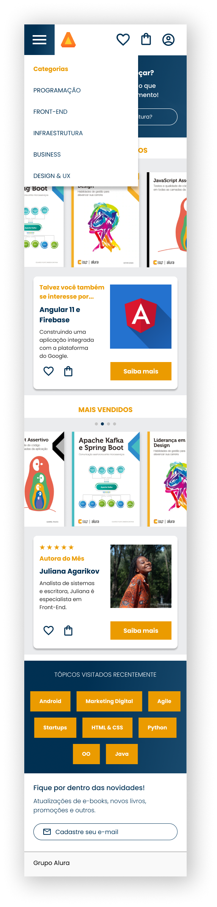
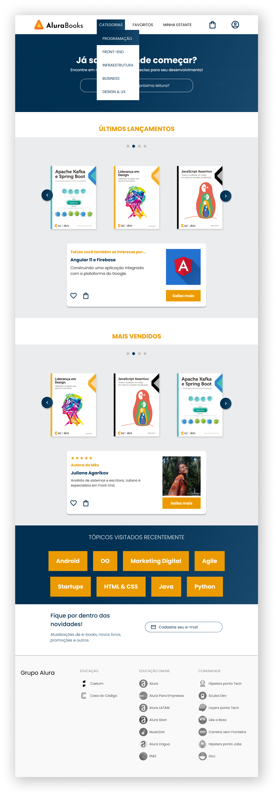
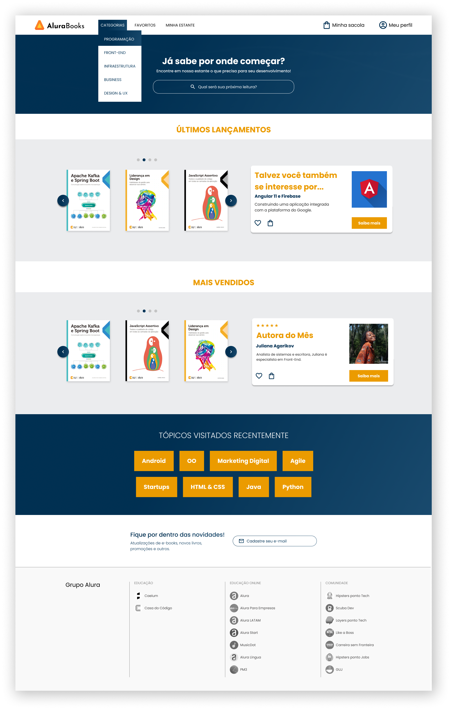

  <figure style="display: inline-block; text-align: center; margin: 2px;">
    
  </figure>
  <figure style="display: inline-block; text-align: center; margin: 2px;">
    
  </figure>
  <figure style="display: inline-block; text-align: center; margin: 2px;">
    
  </figure>

    <h1>Alura Books</h1>

    <h3>🔨 Funcionalidades do Projeto</h3>
    
 
       Projeto desenvolvido utilizando responsividade com mobile-first - layouts de 428px (mobile), 1024px (tablet) e 1728px (desktop):
    

    <h3>✔️ Ferramentas, técnicas e tecnologias utilizadas:</h3>
    
    
    
      

    - Mobile First

